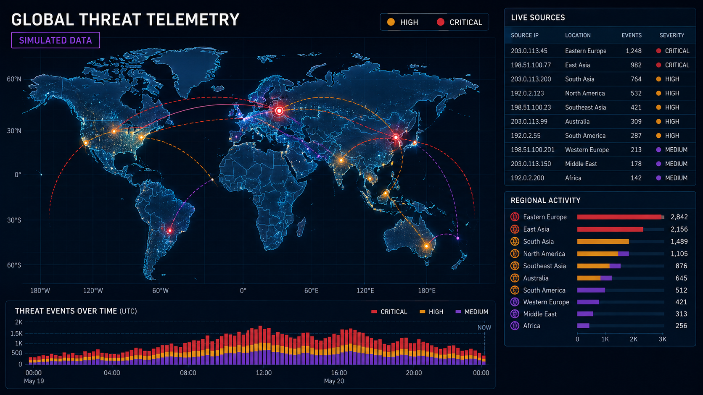
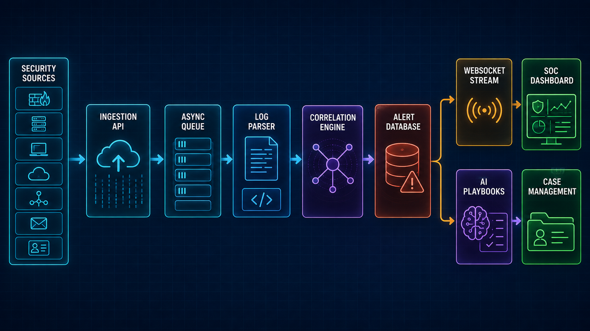
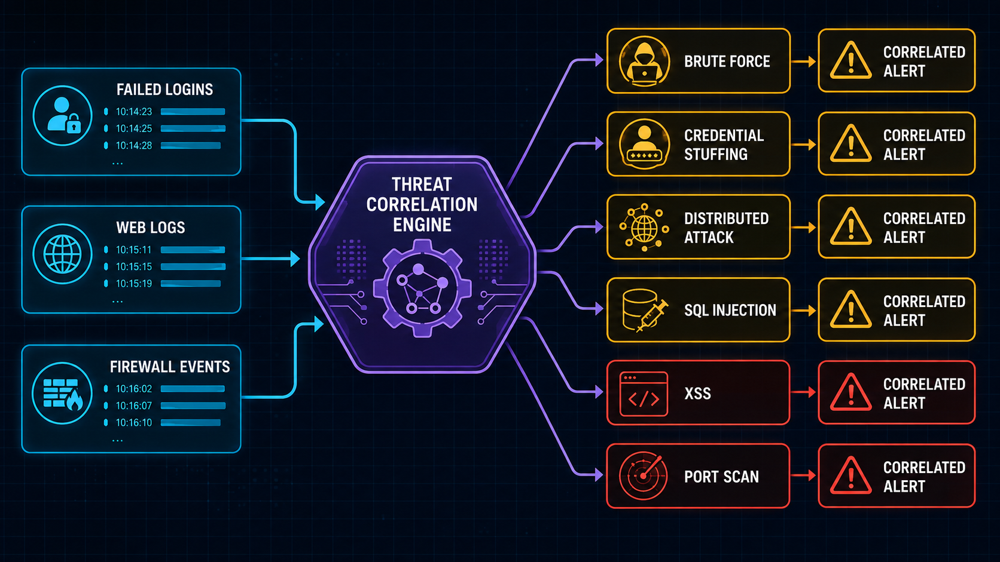
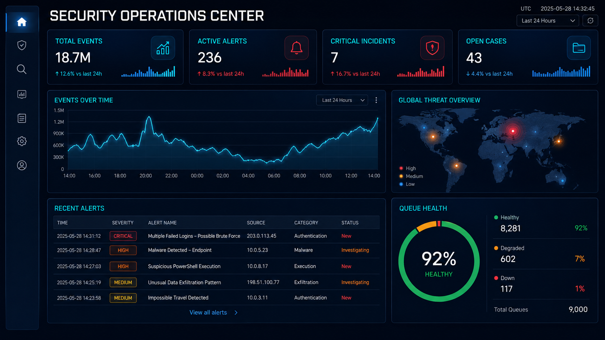
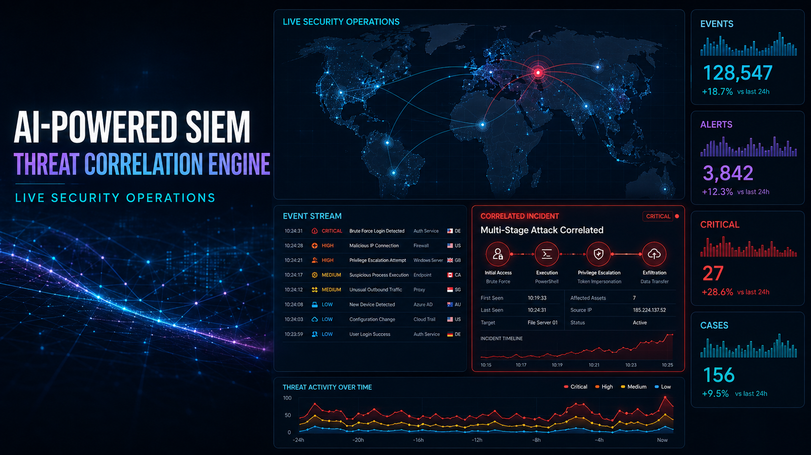
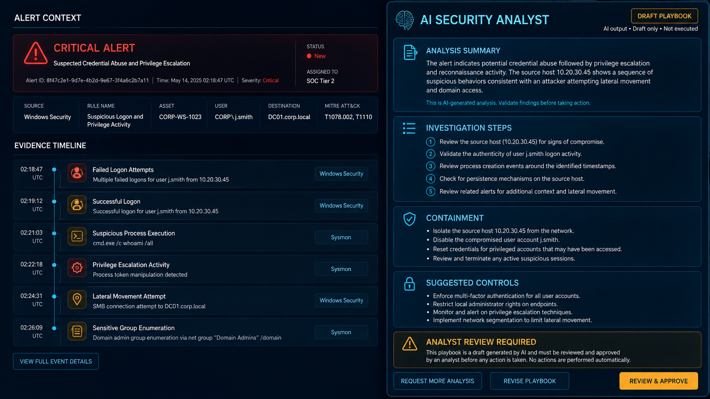
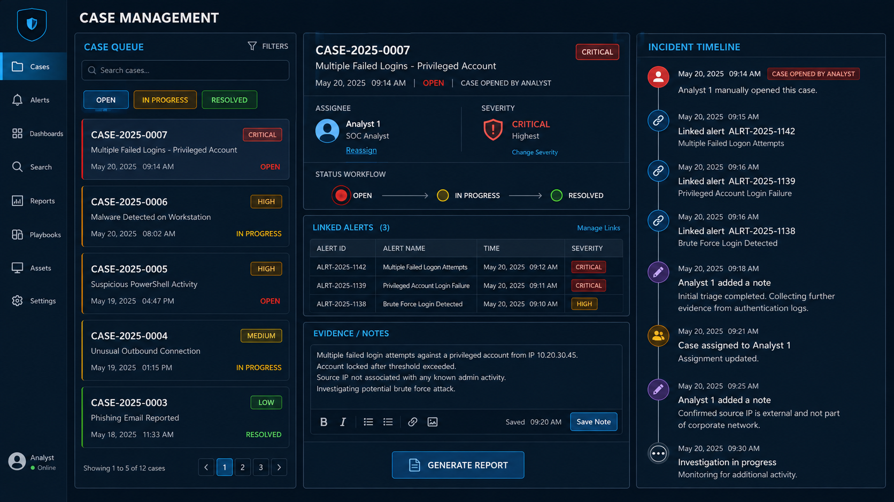
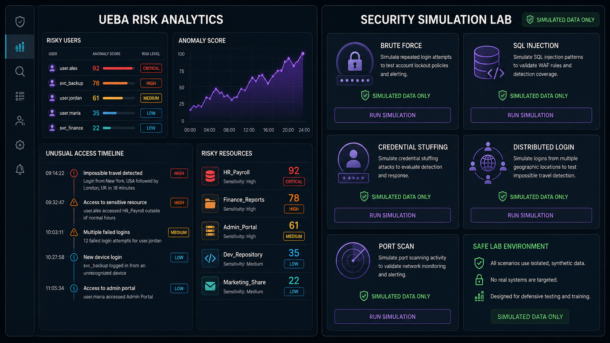

<div align="center">



# 🛡️ AI-Powered SIEM Threat Correlation Engine

### Real-time security telemetry, multi-signal correlation, AI-assisted investigation, and human-led incident response

**Ingest · Correlate · Investigate · Respond**

<p>
  
  
  
  
  
  
  
</p>

[Overview](#-executive-overview) · [Architecture](#%EF%B8%8F-system-architecture) · [Detection](#-detection--correlation-logic) · [Visual Tour](#-visual-product-tour) · [API](#-api-surface) · [Setup](#-quick-start) · [Security](#-security--production-readiness) · [Maintainer](#-developer--maintainer)

</div>

---

> [!IMPORTANT]
> This repository is a **defensive security engineering and training project**. The included simulator uses synthetic events, but the application should still be isolated from production networks until authentication, authorization, rate limiting, secret management, persistence, and deployment controls are hardened.

## 🎯 Executive Overview

The **AI-Powered SIEM Threat Correlation Engine** is a full-stack security operations platform built with **FastAPI**, **React**, **SQLAlchemy**, and **WebSockets**. It accepts structured security logs, parses and stores events, evaluates active detection rules, correlates authentication behavior within sliding time windows, generates alerts, and streams new detections to the analyst dashboard in real time.

Beyond alerting, the platform includes analyst-managed incident cases, live operational metrics, threat telemetry, UEBA-oriented views, controlled attack simulation, reporting workflows, and AI-assisted investigation playbooks. AI output is advisory: analysts review the evidence and retain responsibility for every response action.

### 📊 Platform at a Glance

| Capability | Current implementation |
|---|---|
| 📥 **Collection** | Single or bulk structured-log ingestion over REST |
| ⚡ **Processing** | Direct processing or asynchronous background queue mode |
| 🧩 **Detection** | Cached regex rules plus stateful authentication correlation |
| 🚨 **Alerting** | Severity-tagged alerts persisted and broadcast over WebSockets |
| 📈 **Visibility** | KPI cards, time-series charts, event tables, and world telemetry |
| 👤 **UEBA views** | User risk profiles, anomalous activity, and risky-resource summaries |
| 🤖 **AI assistance** | Structured playbooks and chat through OpenRouter or Mistral, with a local fallback |
| 🗂️ **Cases** | Analyst-created cases with status, assignee, notes, and linked alerts |
| 🧪 **Simulation** | Synthetic brute-force, credential, web, and network scenarios |
| 🐳 **Delivery** | Local development workflow and Docker Compose stack |

---

## ✨ Core Capabilities

- ⚡ **Real-time operations:** new alerts are pushed to connected dashboards through `/ws/alerts`.
- 📦 **Queue-backed ingestion:** logs can be accepted asynchronously and processed by a background worker.
- 🧠 **Stateful correlation:** related authentication events are evaluated across a 60-second sliding window.
- 🧬 **Signature detection:** active regex rules identify web, network, malware, and policy patterns.
- 🔄 **Rule hot refresh:** enabled database rules are cached in memory for correlation.
- 🚦 **Alert lifecycle:** analysts can filter alerts and update investigation status.
- 🤖 **AI investigation support:** alert context can produce a structured draft playbook and streamed chat response.
- 🗃️ **Analysis caching:** generated alert summaries and playbooks are saved with the alert record.
- 👥 **Human-led cases:** analysts create cases, link relevant alerts, assign ownership, and track resolution.
- 🌍 **Operational intelligence:** the frontend combines Recharts analytics with an SVG world map.
- 🧪 **Safe demonstrations:** browser controls and a standalone daemon generate synthetic telemetry.
- 📄 **Reporting workspace:** case and security reporting views organize findings for review.

---

## 🏗️ System Architecture



```text
Security sources
      │
      ▼
FastAPI ingestion endpoint ───────► background queue (optional)
      │                                      │
      └──────────────────┬───────────────────┘
                         ▼
                 parse + persist log
                         │
                         ▼
              cached detection rules
                         │
                         ▼
        signatures + sliding-window correlation
                         │
                         ▼
                alert persistence
                         │
             ┌───────────┴───────────┐
             ▼                       ▼
      WebSocket broadcast      AI draft playbook
             │                       │
             ▼                       ▼
       React SOC dashboard     analyst review
             │
             ▼
      manual case management
```

### 🧱 Component Responsibilities

| Layer | Responsibility |
|---|---|
| **React + Vite** | Dashboard shell, alert triage, charts, map, cases, UEBA, simulator, reports, and settings |
| **FastAPI** | REST endpoints, WebSocket endpoint, validation, startup lifecycle, and service orchestration |
| **Queue worker** | Optional asynchronous log-processing path |
| **Parser service** | Normalizes raw or structured event content before persistence |
| **Rule cache** | Keeps active detection rules available to the correlation engine |
| **Correlation engine** | Runs regex matching and authentication sequence checks |
| **SQLAlchemy layer** | Stores logs, rules, alerts, cases, and AI analysis fields |
| **AI service** | Uses OpenRouter or Mistral when configured and a local response fallback otherwise |
| **WebSocket manager** | Broadcasts correlated alerts to connected clients |

---

## 🧠 Detection & Correlation Logic



### Stateful Authentication Correlation

| Scenario | Correlation key | Default threshold | Window |
|---|---|---:|---:|
| 🔐 **Brute force** | Failed logins from one source IP | 5 attempts | 60 seconds |
| 🎭 **Credential stuffing** | Unique usernames targeted by one source IP | 3 users | 60 seconds |
| 🌐 **Distributed brute force** | Unique source IPs targeting one username | 3 sources | 60 seconds |

When a threshold is reached, the relevant in-memory tracker is cleared and a new alert is persisted with the rule severity and triggering-log relationship.

### Seeded Signature Rules

| Rule family | Example signal | Correlation behavior |
|---|---|---|
| **SQL injection** | SQL syntax patterns in web request content | Immediate signature alert |
| **Cross-site scripting** | Script or HTML-injection patterns | Immediate signature alert |
| **Network scanning** | Nmap or port-scan characteristics | Immediate signature alert |
| **Malware activity** | Trojan, backdoor, or malware indicators | Immediate signature alert |
| **Policy violation** | Forbidden access or privilege-bypass patterns | Immediate signature alert |

> [!NOTE]
> Regex and short-window counters are intentionally understandable for learning and demonstrations. Production detection requires normalized schemas, durable correlation state, tuning, suppression, enrichment, versioned content, and measured false-positive/false-negative performance.

---

## 🖼️ Visual Product Tour

> [!NOTE]
> All eight visuals in this README are **high-fidelity concept illustrations** created for project presentation. They use simulated data and are not pixel-identical screenshots, benchmark evidence, or claims of production deployment.

### 1. 🖥️ Live Security Operations Center



The operational view brings event volume, active alerts, critical incidents, open cases, timeline analytics, recent detections, and queue health into one workspace.

### 2. 🌍 Global Threat Telemetry



Geographical context helps analysts spot changes in source distribution and move from regional trends to individual events. The current frontend uses world-map data and chart-based summaries.

### 3. 🤖 AI Security Analyst



Alert analysis can produce a structured summary, investigation checklist, containment guidance, and suggested controls. The output is explicitly a **draft** and is never a substitute for analyst validation.

### 4. 🗂️ Incident Case Management



Cases are opened by analysts, not automatically by the correlation engine. Alerts can then be linked to a case while status, severity, assignment, notes, and reporting are managed through the investigation lifecycle.

### 5. 👤 UEBA & Security Simulation Lab



The UEBA view summarizes risky users, resources, and recent anomalies. The adjacent simulator creates isolated synthetic events for validating defensive detection paths.

---

## 🔄 Alert-to-Case Workflow

1. **Ingest:** a source submits one or more structured security events.
2. **Normalize:** the parser prepares event fields and the database stores the log.
3. **Evaluate:** active cached rules and stateful correlation logic inspect the event.
4. **Alert:** matching activity creates a severity-tagged alert with trigger context.
5. **Broadcast:** the WebSocket manager pushes the new alert to connected clients.
6. **Triage:** an analyst reviews evidence and changes alert status.
7. **Analyze:** the analyst may request an AI-generated draft playbook.
8. **Escalate manually:** the analyst creates a case and links selected alerts.
9. **Investigate:** the case tracks ownership, notes, state, evidence, and reporting.

---

## 🤖 AI Analyst Routing

The AI service chooses an available provider at runtime:

```text
OpenRouter configured?
    ├── yes → OpenRouter chat/completions
    └── no
         │
         ▼
Mistral configured?
    ├── yes → LangChain ChatMistralAI
    └── no  → local deterministic fallback
```

The alert-analysis endpoint stores generated playbook content so repeated requests can return the cached analysis. Chat supports streamed responses when an external provider is active.

> [!WARNING]
> Security logs are untrusted input. Before production use, protect the AI layer against prompt injection, redact sensitive data, constrain tool permissions, validate structured output, record provenance, and require explicit analyst approval before any action.

---

## 🔌 API Surface

| Method | Route | Purpose |
|---|---|---|
| `GET` | `/` | API status and documentation links |
| `GET` | `/api/v1/health` | Application and database health check |
| `POST` | `/api/v1/logs/ingest` | Ingest log batches; supports `async_mode` |
| `GET` | `/api/v1/logs/stats` | Dashboard and UEBA-oriented statistics |
| `GET/POST/PUT` | `/api/v1/rules` | List, create, and update detection rules |
| `GET` | `/api/v1/alerts` | Filter and retrieve alerts |
| `PUT` | `/api/v1/alerts/{alert_id}/status` | Update alert investigation status |
| `POST` | `/api/v1/alerts/{alert_id}/analyze` | Generate or retrieve a cached AI playbook |
| `POST` | `/api/v1/alerts/chat` | Stream an AI security-assistant response |
| `GET/POST/PUT/DELETE` | `/api/v1/cases` | Manage analyst-created incident cases |
| `POST` | `/api/v1/cases/{case_id}/alerts` | Link an alert to a case |
| `WS` | `/ws/alerts` | Stream newly correlated alerts |

Interactive API documentation is exposed by FastAPI at `/docs` and `/redoc` while the backend is running.

---

## 📁 Project Structure

```text
AI-Powered-SIEM-Threat-Correlation-Engine/
├── backend/
│   ├── app/
│   │   ├── api/v1/endpoints/       # Logs, rules, alerts, and cases
│   │   ├── core/                   # Configuration, database, and logging
│   │   ├── models/                 # SQLAlchemy models and Pydantic schemas
│   │   ├── services/               # Parser, queue, rules, correlation, AI, simulator
│   │   └── main.py                 # FastAPI app and WebSocket endpoint
│   ├── tests/                      # Backend unit and integration tests
│   ├── requirements.txt
│   └── Dockerfile
├── frontend/
│   ├── src/
│   │   ├── components/             # SOC views and analyst workflows
│   │   ├── services/api.js         # REST client configuration
│   │   ├── App.jsx                 # Application shell and real-time state
│   │   └── index.css               # Theme and layout system
│   ├── package.json
│   ├── vite.config.js
│   └── Dockerfile
├── docs/images/                    # Eight README concept visuals
├── simulator_daemon.py             # Continuous synthetic event generator
├── docker-compose.yml              # Frontend and backend orchestration
├── SECURITY.md                     # Vulnerability reporting guidance
├── LICENSE                         # MIT License
└── Readme.md                       # Project documentation
```

---

## 🚀 Quick Start

### Prerequisites

- Python 3.x
- Node.js and npm
- Git
- Optional: Docker Desktop
- Optional for live AI output: an OpenRouter or Mistral API key

### 1. Clone

```powershell
git clone https://github.com/AsadAliEng/AI-Powered-SIEM-Threat-Correlation-Engine.git
Set-Location AI-Powered-SIEM-Threat-Correlation-Engine
```

### 2. Configure the backend

Create a `.env` file in the repository root:

```env
APP_NAME="AI-Powered SIEM"
APP_ENV="development"
DEBUG="True"
DATABASE_URL="sqlite:///./siem_database.db"

# Optional: configure either provider; local fallback works without a key.
OPENROUTER_API_KEY=""
OPENROUTER_MODEL_NAME="google/gemini-2.5-flash"
MISTRAL_API_KEY=""
MISTRAL_MODEL_NAME="mistral-large-latest"
```

Never commit real API keys. Keep `.env` out of version control and rotate any credential that may have been exposed.

### 3. Start the FastAPI backend

```powershell
python -m venv .venv
.\.venv\Scripts\Activate.ps1
python -m pip install --upgrade pip
pip install -r backend\requirements.txt

Set-Location backend
python -m uvicorn app.main:app --reload --host 127.0.0.1 --port 8000
```

Backend URLs:

- API: `http://127.0.0.1:8000`
- Swagger UI: `http://127.0.0.1:8000/docs`
- Health: `http://127.0.0.1:8000/api/v1/health`

### 4. Start the React frontend

Open a second PowerShell terminal from the repository root:

```powershell
Set-Location frontend
npm ci
npm run dev
```

The Vite development server normally opens on `http://127.0.0.1:5173`. Set `VITE_API_BASE_URL` if the backend is hosted elsewhere.

### 5. Generate synthetic telemetry

From the repository root in another terminal:

```powershell
python simulator_daemon.py --attack-ratio 0.2 --interval 2
```

| Option | Meaning |
|---|---|
| `--attack-ratio` | Proportion of generated events that simulate malicious behavior |
| `--interval` | Delay in seconds between generated events |

Use the simulator only in an isolated development or training environment.

---

## 🐳 Docker Compose

```powershell
docker compose up --build
```

| Service | Local address |
|---|---|
| Frontend | `http://localhost` |
| Backend | `http://localhost:8000` |
| API docs | `http://localhost:8000/docs` |

Stop the stack with:

```powershell
docker compose down
```

---

## 🧪 Testing & Quality Checks

The repository includes tests for schemas, rules, parsing, correlation, queues, ingestion, alerts, cases, statistics, and AI-service behavior.

```powershell
Set-Location backend
python -m pytest
```

If `pytest` is not installed in your environment, install your project’s development/test dependencies before running the suite.

Frontend checks:

```powershell
Set-Location frontend
npm run lint
npm run build
```

---

## 🔐 Security & Production Readiness

Before exposing this application beyond a trusted lab, address the following:

- [ ] Add real authentication, session security, and role-based authorization.
- [ ] Replace permissive CORS with an explicit origin allowlist.
- [ ] Add request-size limits, validation, throttling, and abuse protection to ingestion.
- [ ] Store secrets in a managed secret store rather than frontend state or source files.
- [ ] Put TLS and a hardened reverse proxy in front of the API and WebSocket endpoints.
- [ ] Use a production database and durable correlation state for multi-worker deployment.
- [ ] Add tenant isolation, audit trails, retention controls, and immutable evidence handling.
- [ ] Sanitize untrusted log content before rendering it or sending it to an LLM.
- [ ] Evaluate detection accuracy, alert duplication, latency, and failure recovery under load.
- [ ] Restrict the simulator and administrative endpoints to authorized lab users.
- [ ] Review container privileges, filesystem mounts, dependency versions, and network boundaries.

For responsible vulnerability reporting, see [`SECURITY.md`](SECURITY.md).

---

## 🧭 Current Design Boundaries

- Correlation state is kept in process memory, so it is not shared automatically across multiple backend workers.
- Signature rules operate on log-message regex matches and require tuning for real log sources.
- AI playbooks can be generated locally as fallbacks and must not be presented as live model analysis when no provider is active.
- Case auto-creation is disabled; escalation is intentionally controlled by the analyst.
- Dashboard and map content can include synthetic/demo values depending on the active data source.
- SQLite is practical for local use but is not a substitute for a production security-data architecture.

---

## 📚 Origin & Credits

This portfolio presentation preserves the history of the original open-source project while documenting the capabilities present in this codebase.

- 🧬 **Original project:** [devbyjitendra/AI-Powered-SIEM](https://github.com/devbyjitendra/AI-Powered-SIEM)
- 👨‍💻 **Original author:** Jitendra Kumar
- 🎨 **Original demo media:** available under `frontend/assets/`
- 📄 **License:** distributed under the [MIT License](LICENSE)

The eight visuals in `docs/images/` are new documentation concepts created for this repository. They do not replace original screenshots, source-level verification, or security testing.

---

## 🤝 Contributing

Contributions that improve detection quality, test coverage, secure defaults, observability, accessibility, or documentation are welcome.

1. Fork the repository.
2. Create a focused branch: `git checkout -b feature/your-improvement`.
3. Add tests for behavior changes.
4. Run backend and frontend checks.
5. Commit with a clear message and open a pull request.

Please use synthetic, sanitized data in issues, tests, screenshots, and pull requests.

---

## 👨‍💻 Developer & Maintainer

<div align="center">

<a href="https://github.com/AsadAliEng">
  
</a>

### Asad Ali

**Developer · Repository Maintainer**

<p>
  <a href="https://github.com/AsadAliEng">
    
  </a>
  <a href="mailto:asadali.cryptoeng@gmail.com">
    
  </a>
</p>

| Detail | Information |
|---|---|
| 👤 **Name** | Asad Ali |
| 💻 **GitHub** | [@AsadAliEng](https://github.com/AsadAliEng) |
| 📧 **Email** | [asadali.cryptoeng@gmail.com](mailto:asadali.cryptoeng@gmail.com) |

<sub>Open to cybersecurity engineering, AI safety, and defensive automation collaboration.</sub>

</div>

---

<div align="center">

## ⭐ AI-Powered SIEM Threat Correlation Engine

**Observe the signal · Correlate the behavior · Keep humans in control**

Built for transparent threat detection, reproducible security research, and analyst-led response.

<sub>If this project supports your learning or portfolio, consider starring the repository.</sub>

</div>
